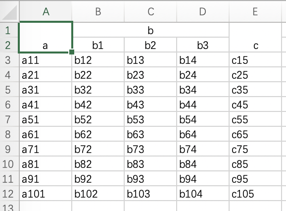

# xlsx生成器

 1. 通过接口实现xlsx输出与数据生成逻辑的分离
 1. 强大的列名生成器，只需通过标题定位列，免去生成列名的困扰
 1. 标题支持子标题，支持多Sheet
 1. xlsx生成文件还是通过网络输出，使用场景自主决定
 1. 通过提供adapter实现通用接口函数，减少实现代码

## 接口定义

```go
type XlsxGenerator interface {
	/// 在输出整个xlsx之前调用，在这里可以做一些输出准备工作
	BeforeOutputXlsx()

	/// 获取输出目标
	GetWriter() io.Writer

	/// 获取Book的sheet名称
	GetSheets() []string

	/// 获取某一个sheet的标题及子标题
	GetTitles(sheet string) []Title

	// 获取某个sheet所有的输出行channel
	GetRows(sheet string) (<-chan map[string]interface{}) // 如果没有subtitle，key={title}; 其它key为{title}_{subtitle}
}

```

## 例子

```go
package main

import (
	"github.com/rosbit/xlsx-generator"
	"os"
	"io"
	"fmt"
)

func main() {
	fp, err := os.Create("a.xlsx")
	if err != nil {
		fmt.Printf("failed to create a.xlsx: %v\n", err)
		return
	}
	defer fp.Close()

	xg := &xlsxTest{fp:fp}
	toxlsx.GenerateXlsx(xg);
}

// ---- XlsxGenerator implementation ----
type xlsxTest struct {
	toxlsx.DummyXlsxGeneratorAdapter
	fp *os.File
}

func (t *xlsxTest) GetWriter() io.Writer {
	return t.fp
}

func (t *xlsxTest) GetSheets() []string {
	return []string{"Sheet1", "Sheet2"}
}

func (a *xlsxTest) GetTitles(sheet string) []toxlsx.Title {
	return []toxlsx.Title{
		toxlsx.Title{
			Name: "a",
		},
		toxlsx.Title{
			Name: "b",
			SubTitles: []string {
				"b1", "b2", "b3",
			},
		},
		toxlsx.Title{
			Name: "c",
		},
	}
}

func (a *xlsxTest) GetRows(sheet string) (<-chan map[string]interface{}) {
	rows := make(chan map[string]interface{})
	go func() {
		for i := 0; i < 10; i++ {
			r := i+1
			row := make(map[string]interface{}, 5) // a, {b1,b2,b3}, c -> 5
			row["a"]    = fmt.Sprintf("a%d%d", r, 1)
			row["b_b1"] = fmt.Sprintf("b%d%d", r, 2)
			row["b_b2"] = fmt.Sprintf("b%d%d", r, 3)
			row["b_b3"] = fmt.Sprintf("b%d%d", r, 4)
			row["c"]    = fmt.Sprintf("c%d%d", r, 5)

			rows <- row
		}

		close(rows)
	}()

	return rows
}
```

## 运行结果

生成a.xlsx，内容如图


